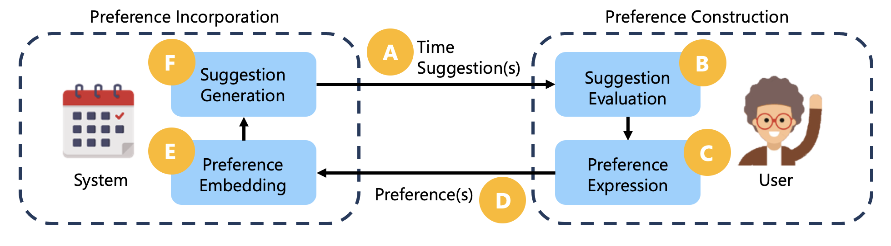

---
layout: project
title: MeetMate
order: 5
description: HUE Group Research Project
vid: null
vid_title:
img_src: ../assets/project/meetmate/meetmateui.png
img_alt: MeetMate supports preference elicitation and decision making within the context of meeting scheduling.
overview: Decision support systems rely on <a href='https://core.ac.uk/download/pdf/147923741.pdf' target='blank'>accurate modeling of user preferences</a>. However, the uncertainty and inconsistency of human preferences <a href='https://link.springer.com/article/10.1007/s11257-011-9116-6' target='blank'>complicates the preference elicitation process</a> between systems and users. MeetMate combined Large Language Models (LLMs) and Constraint Programming to facilitate interactive decision support. 
role: I coordinated and facilitated 10 semi-structured interviews to test the usability of MeetMate. I open-coded all 10 interview sessions and organized the data into affinity diagrams to collaboratively iterate on themes using reflexive thematic analysis. I also collaborated with Dr. Jina Suh to develop an interaction model for MeetMate's preference elicitation process. 
    
     

motivations: The goal of MeetMate was to study how decision support systems can account for the dynamic and subliminal nature of human preferences in decision making.
approach: MeetMate supported iterative preference elicitation through a hybrid LLM and Constraint Programming approach. LLMs enabled an intuitive way for users to communicate their preferences and easily translated preferences into structured constraint functions. Constraint Programming techniques allowed the system to reason over the space of outcomes to find optimal solutions given users' expressed preferences. 
approach_src: ../assets/project/meetmate/approach.png
approach_alt: MeetMate combines LLMs and Constraint Programming to facilitate meeting scheduling.
outcomes: Although users enjoyed the ability to use natural language with MeetMate, they wanted the system to be context-adaptive and provide greater flexibility over what gets optimized. We contributed implications for designing systems that support collaborative human-AI decision-making processes in a <a href='https://arxiv.org/pdf/2312.06908.pdf' target='blank'>paper in submission to ACM Transactions on Interactive Intelligent Systems (TiiS) 2024</a>.
takeaways: This project showed me the importance of a contextual and humanistic approach to human-AI interaction research, balancing AI optimization with user agency to augment and not replace human interactions.
---